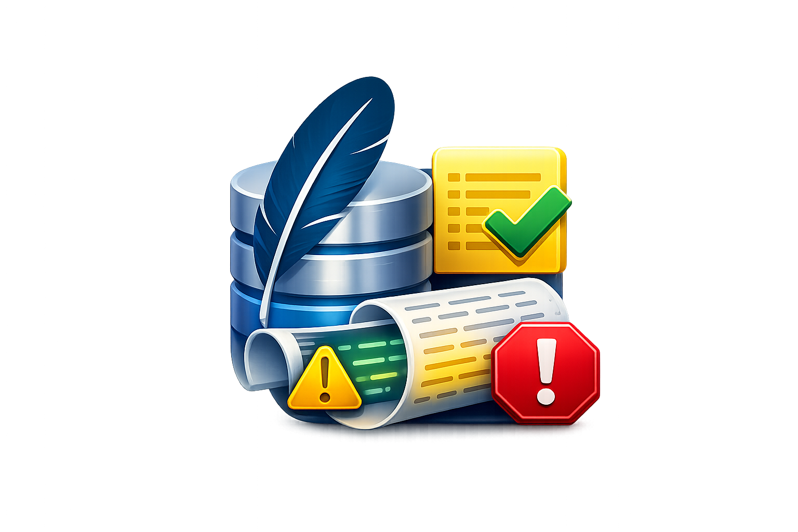
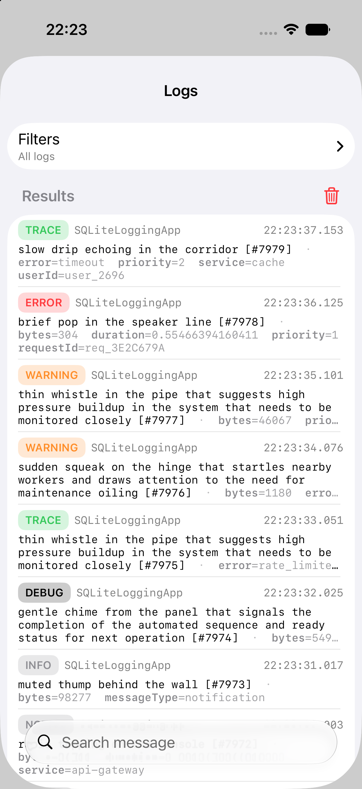
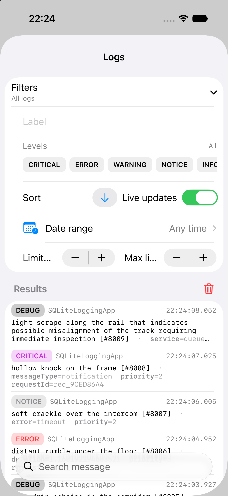

# SQLiteLogging

<p align="center">
  
</p>

<p align="center">
  <a href="https://github.com/mapedd/sqlite-logging/actions/workflows/ci.yml"></a>
  <a href="https://github.com/mapedd/sqlite-logging/releases/tag/0.4.1"></a>
</p>

SQLiteLogging is a Swift Logging backend that persists log events to SQLite, plus a SwiftUI log viewer you can embed in your app. The idea is to keep structured, searchable logs local, fast to write, and easy to inspect during development or QA without needing a remote log pipeline.

<p align="center">
  
  
</p>

## Idea

Most apps already use swift-log for structured logging. SQLiteLogging drops in as the logging backend, stores log events in a lightweight SQLite database, and exposes a simple query API and a SwiftUI viewer. You get durable, filterable logs with minimal setup and no external services.

## Features

- Drop-in backend for swift-log (no call-site changes).
- SQLite storage with optional file-backed persistence or in-memory mode.
- Auto-incremented Int64 IDs for efficient ordering and navigation.
- Backpressure control with queue depth + drop policy and periodic drop summaries.
- Rich querying by time range, level, label, tag, text, and pagination.
- AsyncStream live updates with optional debounce and SQLite-backed filtering.
- SwiftUI log viewer with collapsible filters, search, two-state ordering, and per-level styling.
- Additive level filtering: all logs are shown by default, then selected levels are combined.
- Horizontally scrolling level chips that reveal the most recently selected level when reopened.
- Compact date-range editor with optional minimum/maximum bounds and quick presets.
- **Log Detail View** with navigation arrows to browse next/previous logs without dismissing.
- **Clear Logs** functionality with confirmation alert.
- **Compact log rows** with level, label, and timestamp on one line and three message lines by default.
- **Configurable message lines** (1-100 lines) and query limit in a shared compact row.
- **Smart timestamp display**: shows time only for today, date+time otherwise, with millisecond precision.
- **Rich metadata display** with metadata keys visually separated from the message.
- Reusable **LevelPill** component for consistent log level styling.
- Works across Apple platforms (iOS, macOS, tvOS, watchOS).

## Requirements

- Swift 6.2 toolchain (per `Package.swift`).
- iOS 17+/macOS 13+/tvOS 17+/watchOS 10+ for the library.
- The sample app target is set to iOS 26.0 in `project.yml`.

## Integration (Swift Package Manager)

Add the package to your app target:

```swift
// Package.swift
.dependencies: [
    .package(url: "https://github.com/mapedd/sqlite-logging.git", from: "0.4.1")
],
.targets: [
    .target(
        name: "YourApp",
        dependencies: [
            .product(name: "SQLiteLogging", package: "sqlite-logging"),
            .product(name: "SQLiteLoggingViewer", package: "sqlite-logging")
        ]
    )
]
```

For local development, use `.package(path: "../sqlite-logging")` instead.

If you only need the backend, depend on `SQLiteLogging` only. The viewer lives in `SQLiteLoggingViewer`.

## Usage

### Bootstrap the logging system

```swift
import Logging
import SQLiteLogging

let config = SQLiteLoggingConfiguration(
    appName: "MyApp",
    queueDepth: 1024,
    dropPolicy: DropPolicy(dropBelow: .debug),
    database: .default(fileName: "myapp-logs.sqlite", maxDatabaseBytes: 50_000_000)
)

let components = try SQLiteLoggingSystem.make(configuration: config)
LoggingSystem.bootstrap(components.handlerFactory)
let manager = components.manager
let logger = Logger(label: "com.example.myapp")

logger.info("App started", metadata: ["session": "123"])
```

Call `await manager.flush()` before termination or when you need logs fully persisted.

If you need to combine multiple handlers, use `MultiplexLogHandler`:

```swift
let components = try SQLiteLoggingSystem.make(configuration: config)
let other = StreamLogHandler.standardOutput(label: "stdout")
LoggingSystem.bootstrap { label in
    MultiplexLogHandler([
        components.handlerFactory(label),
        other
    ])
}
let manager = components.manager
```

### Clear all logs

```swift
try await manager.clearAllLogs()
```

This permanently deletes all log entries from the database.

### Query logs

```swift
let records = try await manager.query(
    LogQuery(
        from: Date().addingTimeInterval(-3600),
        levels: [.error, .critical],
        messageSearch: "network",
        limit: 200
    )
)
```

Each `LogRecord` includes:
- `id`: Auto-incremented Int64 for database ordering
- `timestamp`: Date with millisecond precision
- `level`: Logger.Level (trace, debug, info, notice, warning, error, critical)
- `label` and `tag`: String identifiers
- `message`: Log message text
- `metadataJSON`: JSON-encoded metadata dictionary
- `appName`, `source`, `file`, `function`, `line`: Source location info

### Stream live logs

```swift
let stream = await manager.logStream(query: LogQuery(messageSearch: "db"))
for await record in stream {
    print(record.message)
}
```

### Embed the viewer

```swift
import SQLiteLoggingViewer
import SwiftUI

struct LogsView: View {
    let manager: SQLiteLogManager

    var body: some View {
        SQLiteLogViewer(manager: manager)
    }
}
```

You can customize colors and fonts via `SQLiteLogViewerStyle`.

#### Viewer Features

- **Tappable log rows**: Tap any log to open the detail view.
- **Log Detail View**: Browse logs with next/previous navigation arrows.
- **Smart timestamps**: Shows `HH:mm:ss.SSS` for today's logs, `dd/MM/yy HH:mm:ss.SSS` for older logs.
- **Additive level filtering**: Start with all logs, then tap Error, Warning, or any other level to combine filters.
- **Selected-filter summary**: The collapsed Filters row shows active levels, label, and date range.
- **Compact level carousel**: Level chips stay on one line and reopen at the most recently selected level.
- **Date range editor**: Set optional minimum and maximum dates or choose a quick range.
- **Two-state ordering**: Switch between newest-first and oldest-first with the sort arrow button.
- **Configurable display**: Adjust the query limit and message line limit (1-100) in one row.
- **Dense rows**: Level, label, and timestamp share one line; messages show three lines by default.
- **Readable metadata**: Metadata keys use a distinct secondary treatment so message boundaries remain clear.
- **Clear logs**: Tap the trash icon in the Results header to clear all logs.
- **Live updates**: Real-time log streaming with optional debounce.
- **Rich filtering**: By level, label, date range, and text search.

## Sample app

The sample app lives in `App/` and uses `SQLiteLogViewer` to browse logs. It is generated using XcodeGen via `project.yml`.
It generates a new random log every second so you can see live updates in the viewer.

### Generate the Xcode project with XcodeGen

```bash
brew install xcodegen
xcodegen generate
```

This creates `SQLiteLoggingApp.xcodeproj` from `project.yml`.

### Build and run on iOS Simulator

```bash
open SQLiteLoggingApp.xcodeproj
```

Select the `SQLiteLoggingApp` scheme and run on an iPhone simulator. The project is configured for iOS 26.0 (see `project.yml`), so use an iOS 26 runtime.

## Screenshots

The screenshots above show the compact log list and expanded filter controls in the sample app running on an iPhone simulator.
